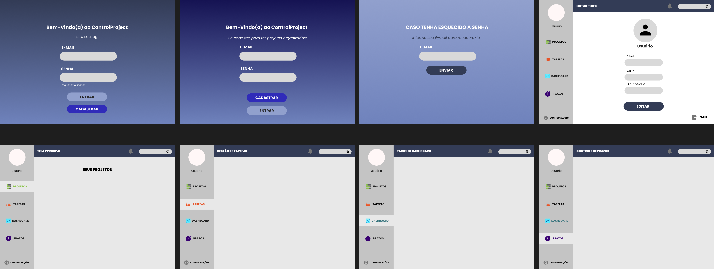

# Prototipagem do Sistema

A estrutura inicial das telas do sistema foi planejada com foco em organização das informações e facilidade de uso, permitindo ao usuário gerenciar projetos e tarefas de forma clara e intuitiva.

## Telas planejadas

- Dashboard com resumo de projetos e tarefas
- Tela de listagem de projetos
- Tela de cadastro e edição de projetos
- Tela de gerenciamento de tarefas
- Visualização de progresso do projeto

## Protótipo

Imagem do protótipo inicial do sistema:

Caso queira visualizar o protótipo completo:

Link: https://www.figma.com/design/hp0RnguDEHQlsVsdGty9Nr/Controle-de-Projetos?t=LfNrzSPBGMl5jC1j-1

